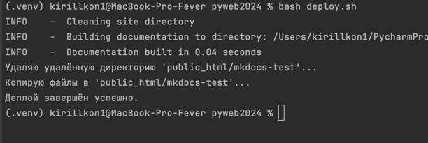
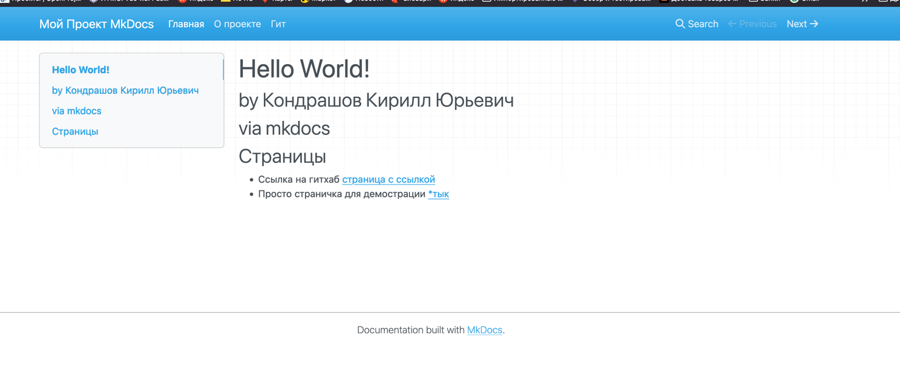

# Проектирование и развертывание веб-решений в эко-системе Python
### Лабораторная работа №1

---
## Создание статического сайта с помощью MkDocs - инструмента для создания статических сайтов документации, разработанный на языке программирования Python

### Билд сайта и деплой на сервер Гелоиса происходит с помощью скрипта deploy.sh. Для корректной работы должны быть установлены MkDocs и sshpass
### Также нужно ввести свой логин (s000000) и пароль в deploy.sh в соответствующих полях

### Посмотреть статический сайт проекта тут: [https://se.ifmo.ru/~s284702/mkdocs-test/site/](https://se.ifmo.ru/~s284702/mkdocs-test/site/)

## Пример деплоя 

