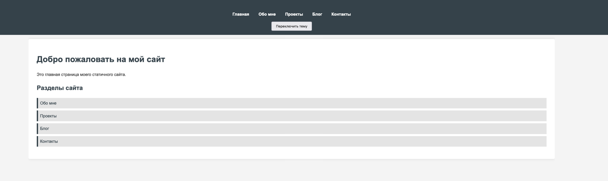
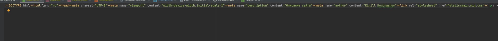
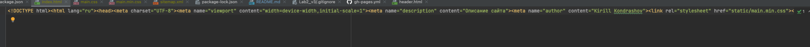
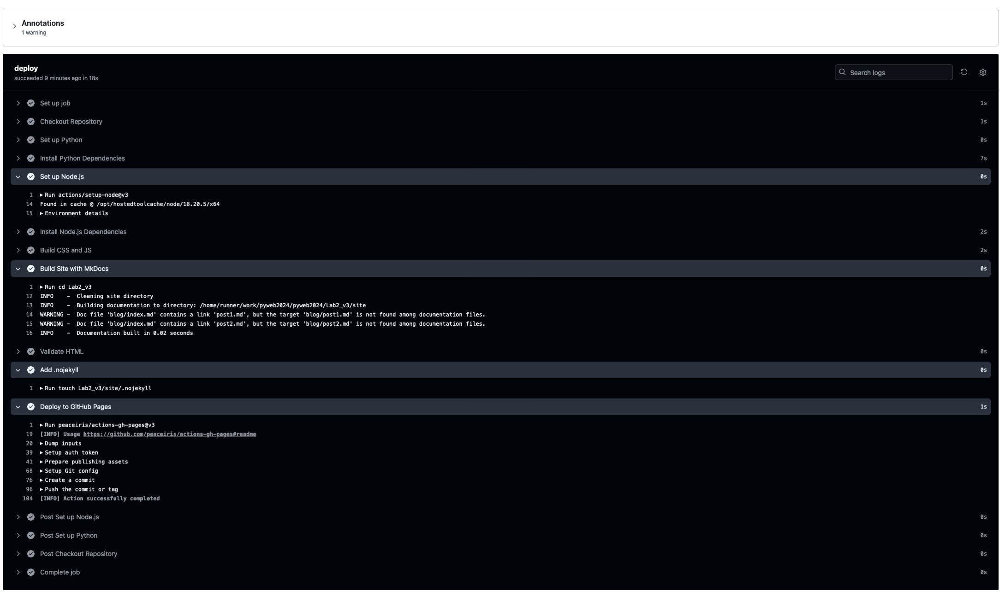

# Лабораторная работа #2

ссылка: https://kirillkon1.github.io/pyweb2024/


Демонстрация:



css:


html:



## Содержимое .github/workflow/pg-pages.yml

```yaml
name: Deploy Custom MkDocs Site to GitHub Pages

on:
  push:
    branches:
      - main

permissions:
  contents: write

jobs:
  deploy:
    runs-on: ubuntu-latest
    steps:
      - name: Checkout Repository
        uses: actions/checkout@v3

      - name: Set up Python
        uses: actions/setup-python@v4
        with:
          python-version: '3.x'

      - name: Install Python Dependencies
        run: |
          pip install mkdocs mkdocs-material

      - name: Set up Node.js
        uses: actions/setup-node@v3
        with:
          node-version: "18"

      - name: Install Node.js Dependencies
        run: |
          cd Lab2_v3
          npm install

      - name: Build CSS and JS
        run: |
          cd Lab2_v3
          npm run build

      - name: Build Site with MkDocs
        run: |
          cd Lab2_v3
          mkdocs build --clean

      - name: Validate HTML
        run: |
          cd Lab2_v3
          npm run validate:html

      - name: Add .nojekyll
        run: |
          touch Lab2_v3/site/.nojekyll

      - name: Deploy to GitHub Pages
        uses: peaceiris/actions-gh-pages@v3
        with:
          github_token: ${{ secrets.GITHUB_TOKEN }}
          publish_dir: Lab2_v3/site

```

## Github Actions

