# **Getting Started Walk-through for IT Pros and System Administrators**

##  **Stage 1: The Basics**

---
##  Docker for Developers Stage 1

### Task 1: Run some simple Docker containers

```bash
docker container run alpine hostname
docker container ls --all
```
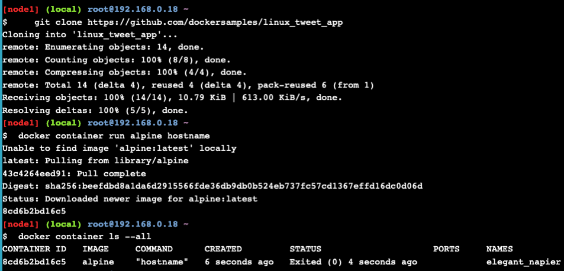

#### Run a background MySQL container

```bash
 docker container run \
 --detach \
 --name mydb \
 -e MYSQL_ROOT_PASSWORD=my-secret-pw \
 mysql:latest
```
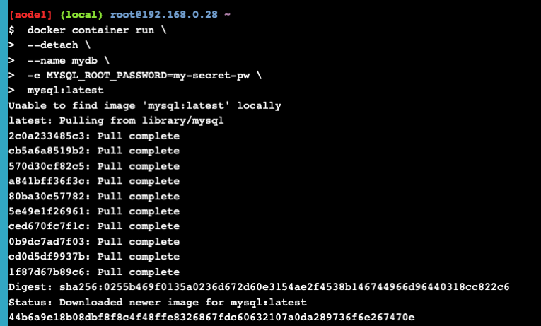
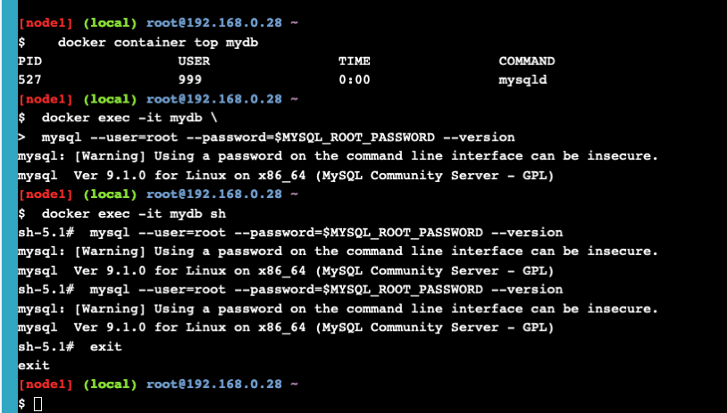

### Task 2: Package and run a custom app using Docker
#### Build a simple website image

```bash
 cd ~/linux_tweet_app
 cat Dockerfile
```

```
 FROM nginx:latest

 COPY index.html /usr/share/nginx/html
 COPY linux.png /usr/share/nginx/html

 EXPOSE 80 443    

 CMD ["nginx", "-g", "daemon off;"]

```

```bash
export DOCKERID=kirillkon1
docker image build --tag $DOCKERID/linux_tweet_app:1.0 .
```
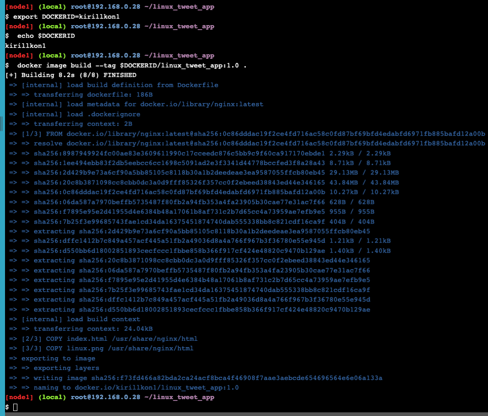


```bash
 docker container run \
 --detach \
 --publish 80:80 \
 --name linux_tweet_app \
 $DOCKERID/linux_tweet_app:1.0
```

```bash
 docker container rm --force linux_tweet_app
```
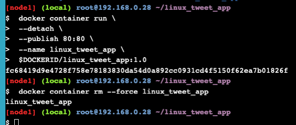


### Task 3: Modify a running website

```bash
docker container run \
 --detach \
 --publish 80:80 \
 --name linux_tweet_app \
 --mount type=bind,source="$(pwd)",target=/usr/share/nginx/html \
 $DOCKERID/linux_tweet_app:1.0
```

#### Modify the running website

```bash
 cp index-new.html index.html
```

```bash
 docker rm --force linux_tweet_app
 
  docker container run \
 --detach \
 --publish 80:80 \
 --name linux_tweet_app \
 $DOCKERID/linux_tweet_app:1.0
 
 docker rm --force linux_tweet_app
```

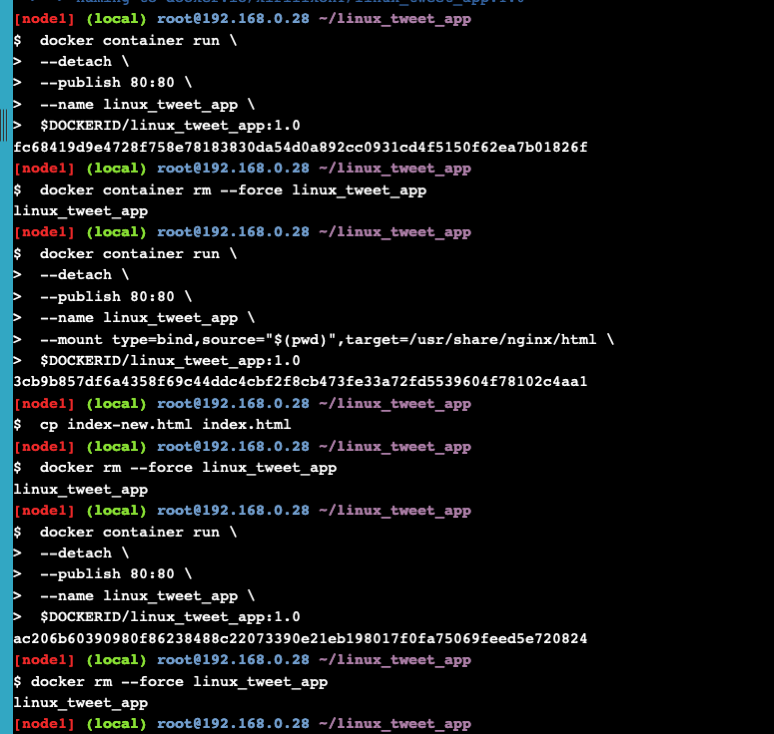


#### Update the image

```bash
docker image build --tag $DOCKERID/linux_tweet_app:2.0 .
```
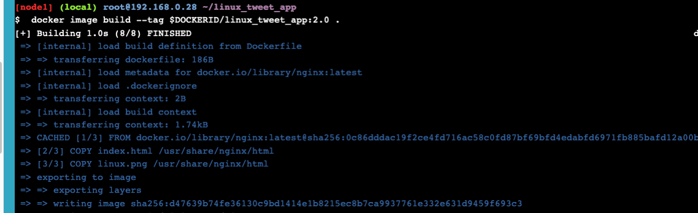

#### Test the new version

```bash
 docker container run \
 --detach \
 --publish 80:80 \
 --name linux_tweet_app \
 $DOCKERID/linux_tweet_app:2.0
```

```bash
 docker container run \
 --detach \
 --publish 8080:80 \
 --name old_linux_tweet_app \
 $DOCKERID/linux_tweet_app:1.0
```

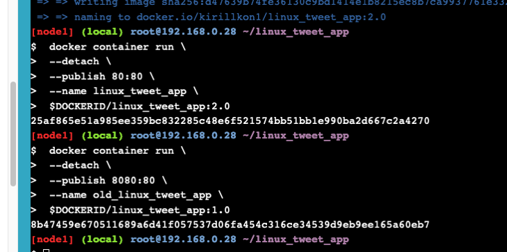


#### Push your images to Docker Hub

```bash
 docker image ls -f reference="$DOCKERID/*"
```
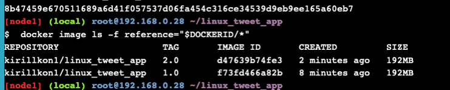
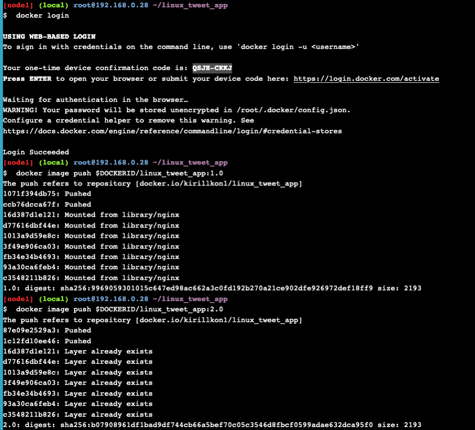
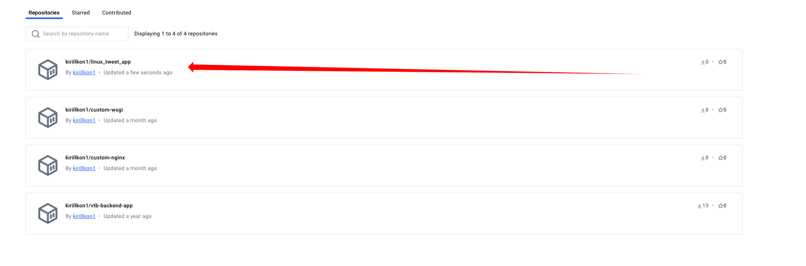


## Application Containerization and Microservice Orchestration

### Setup
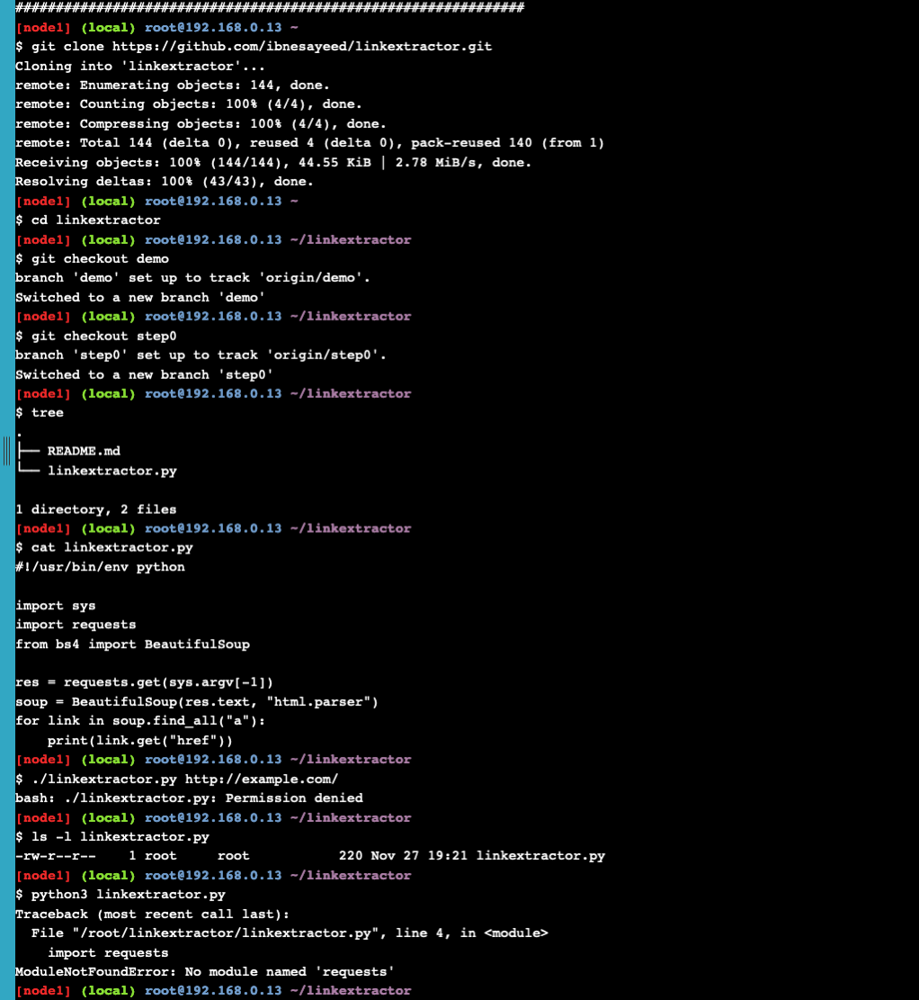

### Step 1 Containerized Link Extractor Script

```bash
cat Dockerfile
```

```yaml
FROM       python:3
LABEL      maintainer="Sawood Alam <@ibnesayeed>"

RUN        pip install beautifulsoup4
RUN        pip install requests

WORKDIR    /app
COPY       linkextractor.py /app/
RUN        chmod a+x linkextractor.py

ENTRYPOINT ["./linkextractor.py"]
```

```bash
docker image build -t linkextractor:step1 .
```
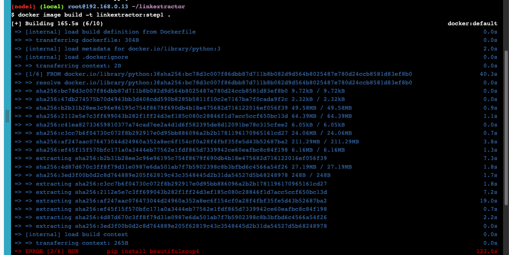

## Образ побитый, поэтому пропускаем первый этап

### Step 2: Link Extractor Module with Full URI and Anchor Text

```bash
git checkout step2
tree

cat linkextractor.py
```

```python
#!/usr/bin/env python

import sys
import requests
from bs4 import BeautifulSoup
from urllib.parse import urljoin

def extract_links(url):
    res = requests.get(url)
    soup = BeautifulSoup(res.text, "html.parser")
    base = url
    # TODO: Update base if a <base> element is present with the href attribute
    links = []
    for link in soup.find_all("a"):
        links.append({
            "text": " ".join(link.text.split()) or "[IMG]",
            "href": urljoin(base, link.get("href"))
        })
    return links

if __name__ == "__main__":
    if len(sys.argv) != 2:
        print("\nUsage:\n\t{} <URL>\n".format(sys.argv[0]))
        sys.exit(1)
    for link in extract_links(sys.argv[-1]):
        print("[{}]({})".format(link["text"], link["href"]))
```

```bash
docker image build -t linkextractor:step2 .
```

## Образ побитый, поэтому пропускаем первый этап
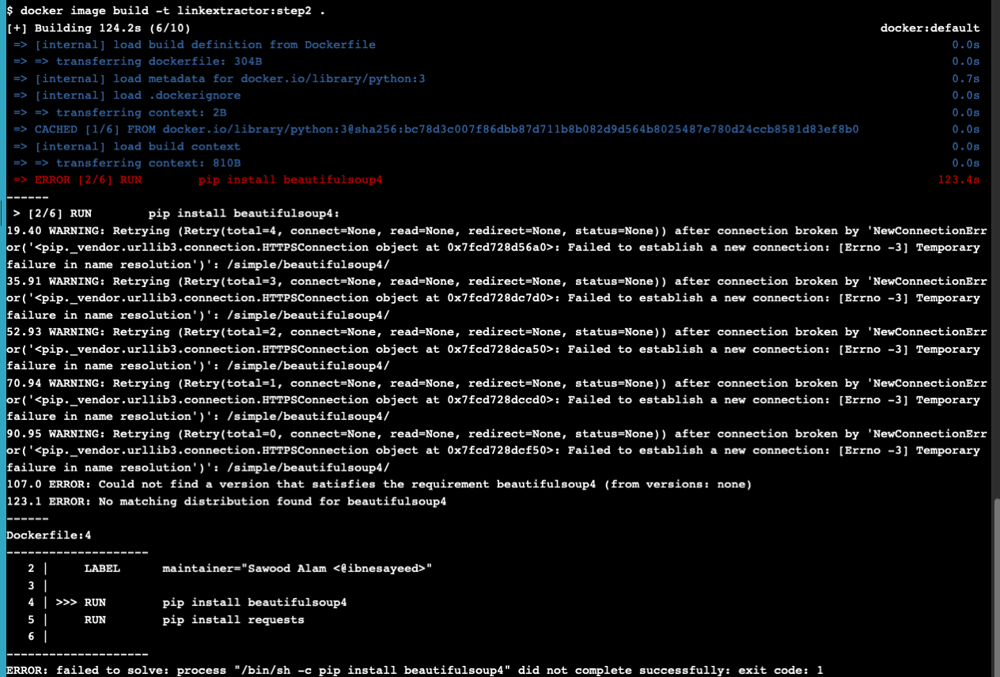

### Step 3: Link Extractor API Service

## Аналогичная ошибка. Проблема в получении и установке библиотеки bs4

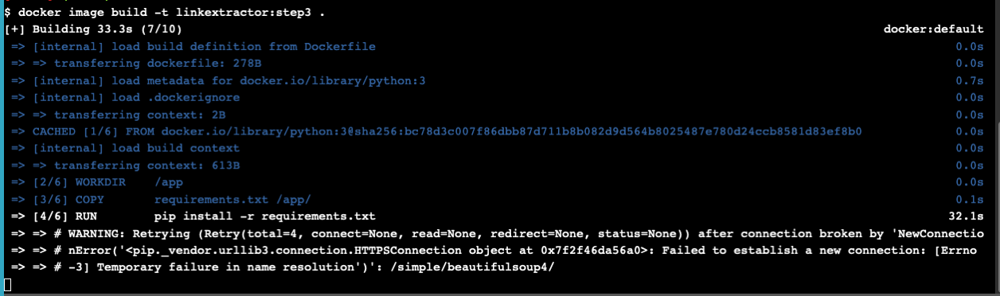

### Step 4: Link Extractor API and Web Front End Services

```bash
git checkout step4
tree

cat docker-compose.yml
```

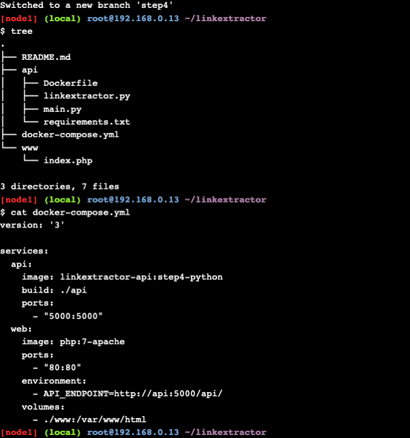

```bash
docker-compose up -d --build
```

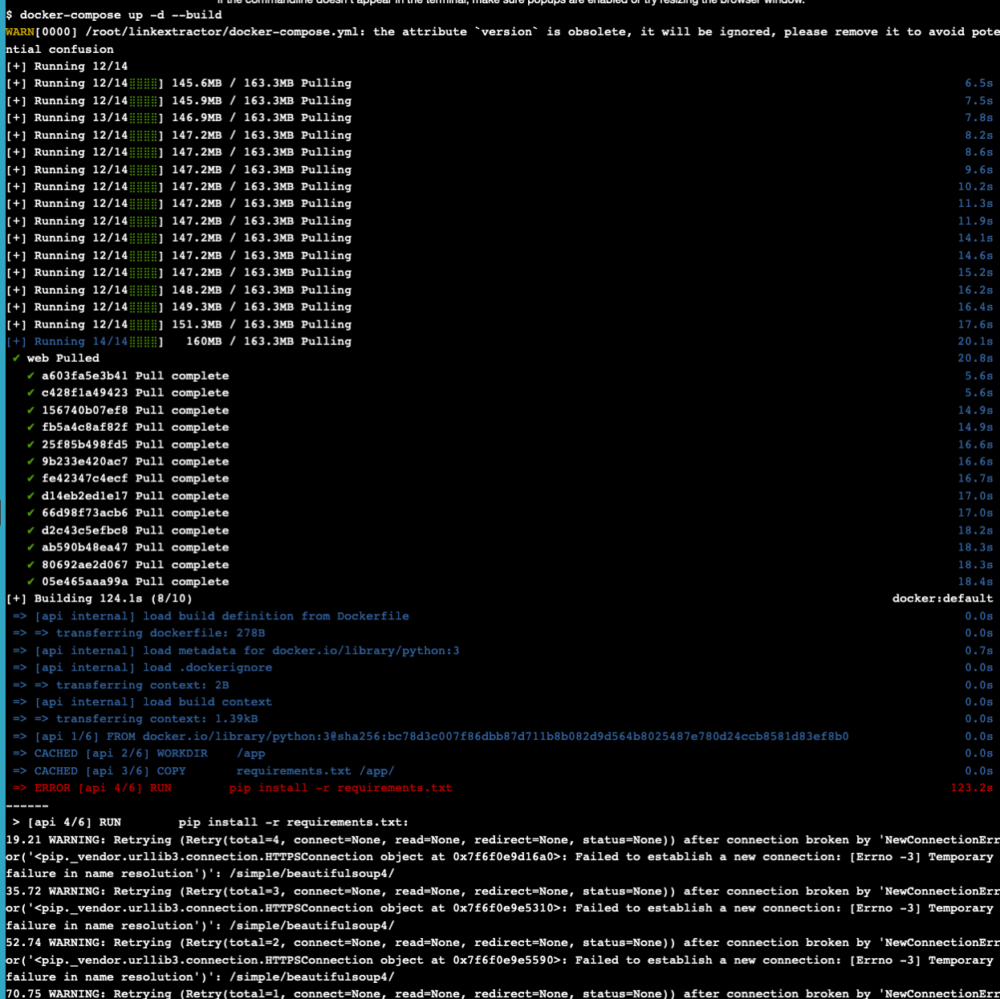

## Аналогичная ошибка

### P.S. В дальнейших этапах вылезает та же самая ошибка

## Swarm stack introduction

```bash
docker swarm init --advertise-addr $(hostname -i)
```

```bash
git clone https://github.com/docker/example-voting-app
cd example-voting-app
```

```bash
docker stack deploy --compose-file=docker-stack.yml voting_stack
```

```bash
docker stack services voting_stack
```
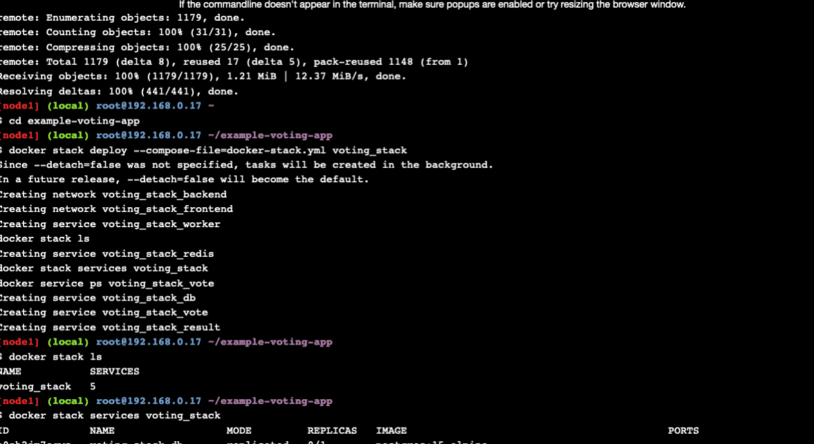

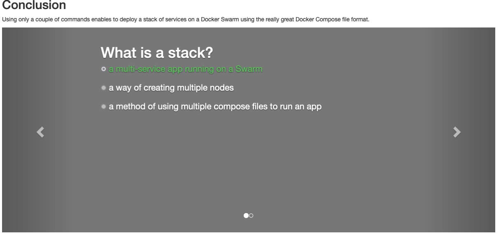


## Docker for Developers Stage 2
#### Крайне непонятное задание: по-сути нужно просто настроить Docker в одной из IDE

#### Мой пример в IntelliJ IDEA:

```dockerfile
# Use an official OpenJDK runtime with Java 17 as a parent image
FROM openjdk:19

# Set the working directory in the container
WORKDIR /app

# Copy the application JAR (assuming it's in the target directory after building)
COPY build/libs/*.jar /app/app.jar

# Expose the port that your application will run on
EXPOSE 8080

# Specify the command to run on container start
CMD ["java", "-jar", "app.jar"]

LABEL name=spring-application
```

```yaml
services:
  postgres:
    image: 'postgres:latest'
    environment:
      - POSTGRES_USER=postgres
      - POSTGRES_PASSWORD=postgres
      - POSTGRES_DB=postgres
    ports:
      - "8088:5432"
#    volumes:
#      - postgres_data:/var/lib/postgresql/data

  spring-application:
    build:
      context: .
      dockerfile: Dockerfile
    container_name: remember-spring-project
    ports:
      - "80:8080"
    depends_on:
      - postgres
    environment:
      SPRING_DATASOURCE_URL: jdbc:postgresql://postgres:5432/postgres
      SPRING_DATASOURCE_USERNAME: postgres
      SPRING_DATASOURCE_PASSWORD: postgres

#volumes:
#  postgres_data:
```

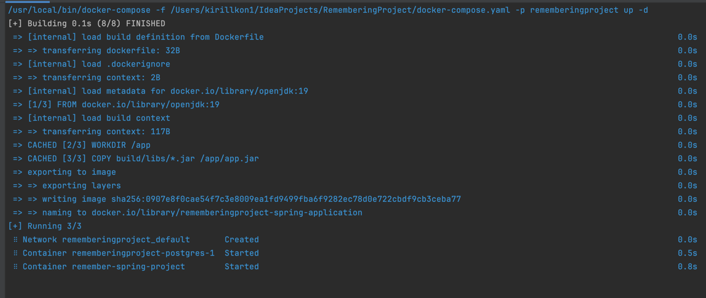
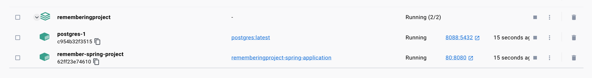

## Docker for Developers Stage 3

### Тут просто видео и ссылки на документацию