## Getting Started Walk-through for IT Pros and System Administrators

### **Stage 1: The Basics**
#### 1.0 Running your first container

```bash
docker container run hello-world
```
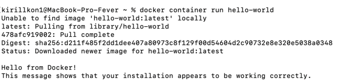

#### 1.1 Docker Images

```bash
docker image pull alpine
```
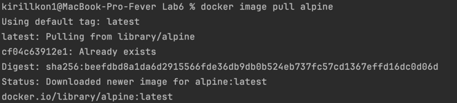

```bash
docker image ls
```
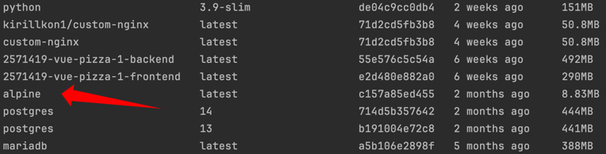

#### Docker Container Run

```bash
docker container run alpine ls -l
```
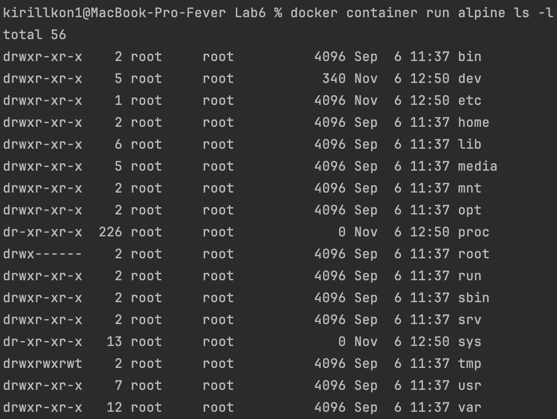

```bash 
docker container run alpine echo "hello from alpine"
```
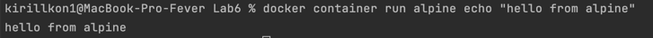

```bash
docker container run -it alpine /bin/sh
```
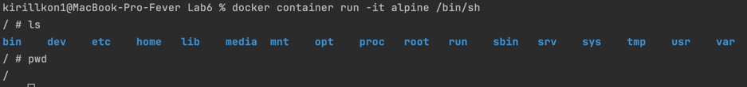

```bash
docker container ls
```
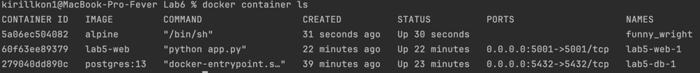

```bash
docker container ls -a
```
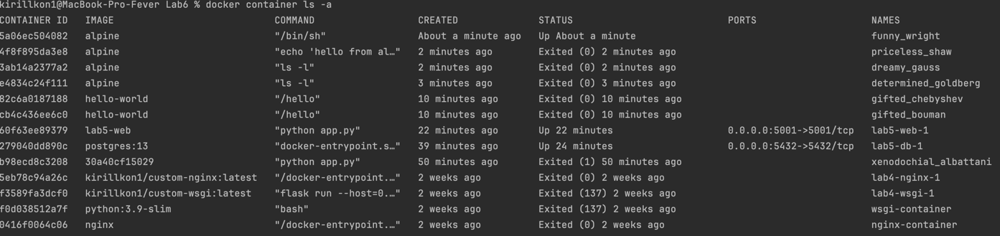


#### 1.2 Container Isolation

```bash
docker container run -it alpine /bin/ash
```
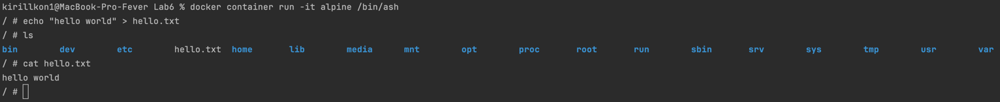

```bash
docker container run alpine ls
```
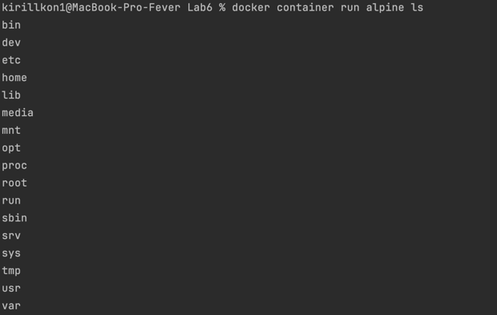

```bash
docker container ls -a
```
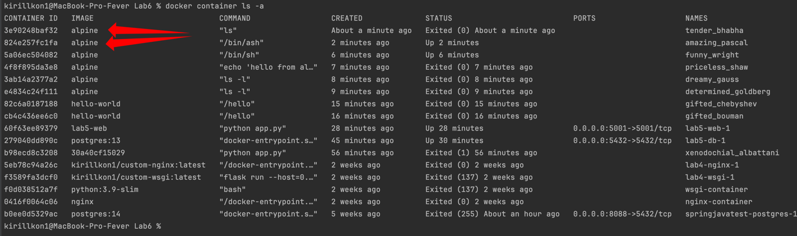


```bash
docker container start <container ID>
```

```bash
docker start 824e257fc1fa
docker exec -it 824e257fc1fa /bin/ash
```
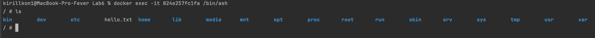

#### 1.3 Terminology

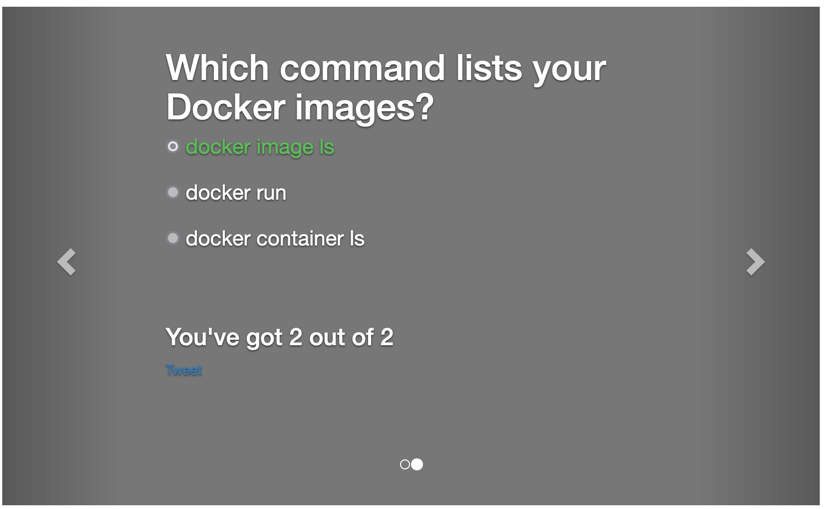


#### **Doing More With Docker Images**

```bash
docker container run -ti ubuntu bash
```

```bash
apt-get update
apt-get install -y figlet
figlet "hello docker"
```
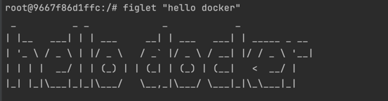


```bash
docker container ls -a
docker container commit CONTAINER_ID
```

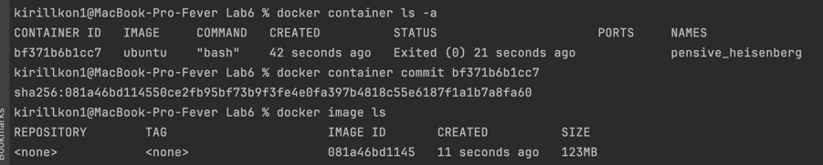

```bash
docker image tag <IMAGE_ID> ourfiglet
docker image ls
```

```bash
docker image tag 081a46bd1145 ourfiglet
docker image ls
```
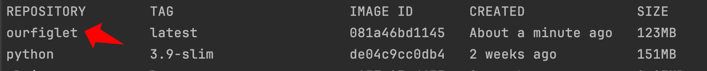

```bash
docker container run ourfiglet figlet hello
```
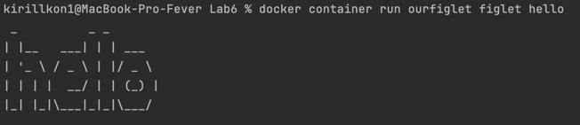

```bash
vim index.js
```

```vim
var os = require("os");
var hostname = os.hostname();
console.log("hello from " + hostname);
```

```bash
vim Dockerfile
```

```vim
FROM alpine
RUN apk update && apk add nodejs
COPY . /app
WORKDIR /app
CMD ["node","index.js"]
```

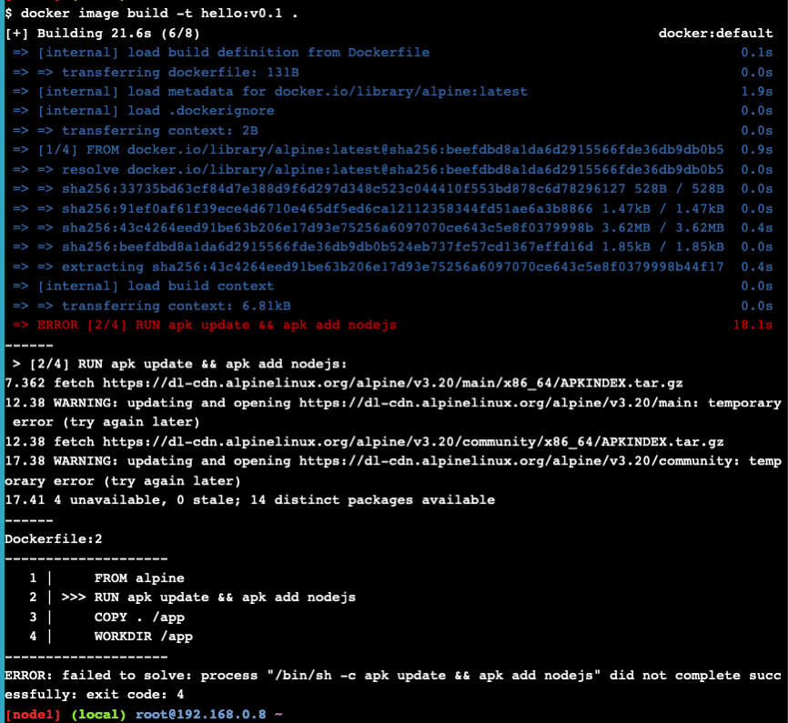
#### *это косяк курса


### **Image Inspection**
```bash
docker image pull alpine
```
```bash
docker image inspect alpine
```
```bash
docker image inspect --format "{{ json .RootFS.Layers }}" alpine
```
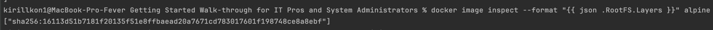


### **Swarm Mode Introduction for IT Pros**

```bash
docker swarm init --advertise-addr $(hostname -i)
```

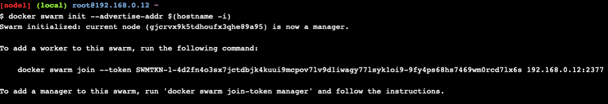

```bash
docker node ls
```
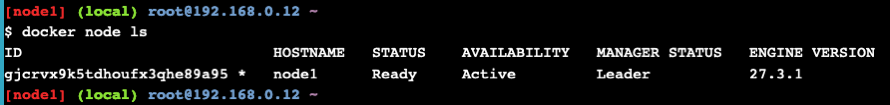

```bash 
git clone https://github.com/docker/example-voting-app
cd example-voting-app
docker stack deploy --compose-file=docker-stack.yml voting_stack
docker stack ls
```
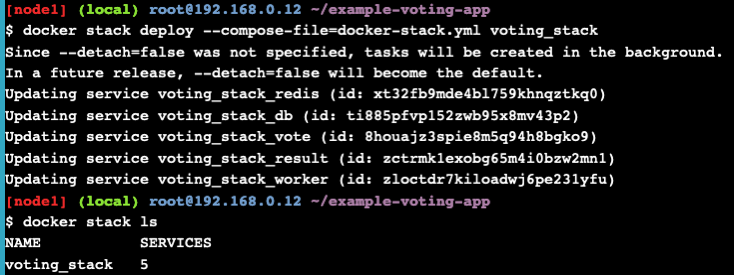

```bash
docker stack services voting_stack
docker service ps voting_stack_vote
```
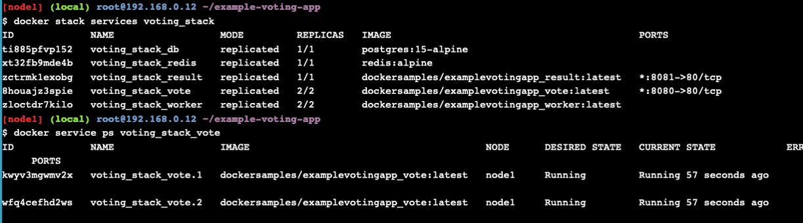


## Stage 2: Digging Deeper

### Security Lab: Seccomp

---

#### Step 1: Clone the labs GitHub repo
```bash
git clone https://github.com/docker/labs
cd labs/security/seccomp
```
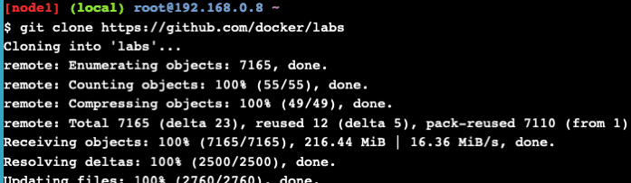

#### Step 2: Test a seccomp profile

```bash
docker run --rm -it --cap-add ALL --security-opt apparmor=unconfined --security-opt seccomp=seccomp-profiles/deny.json alpine sh
```

```bash
cat seccomp-profiles/deny.json
```
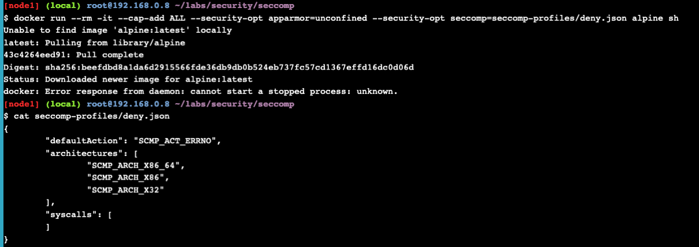

#### Step 3 - Run a container with no seccomp profile
```bash
docker run --rm -it --security-opt seccomp=unconfined debian:jessie sh
unshare --map-root-user --user
whoami
```
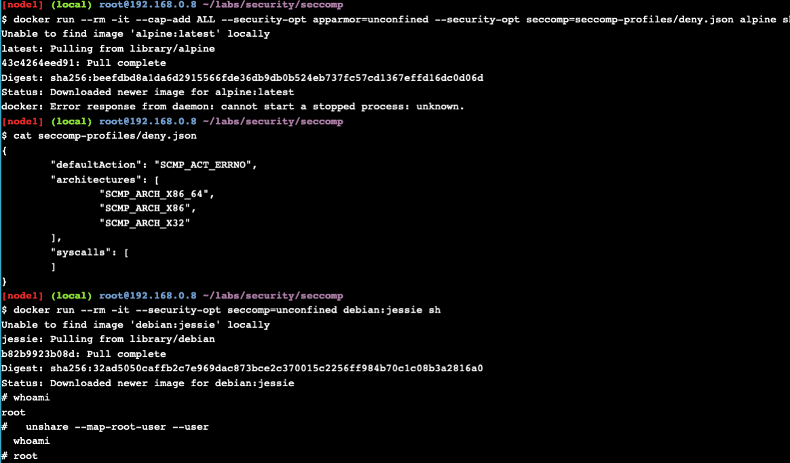

```bash
apk add --update strace
strace -c -f -S name whoami 2>&1 1>/dev/null | tail -n +3 | head -n -2 | awk '{print $(NF)}'
```

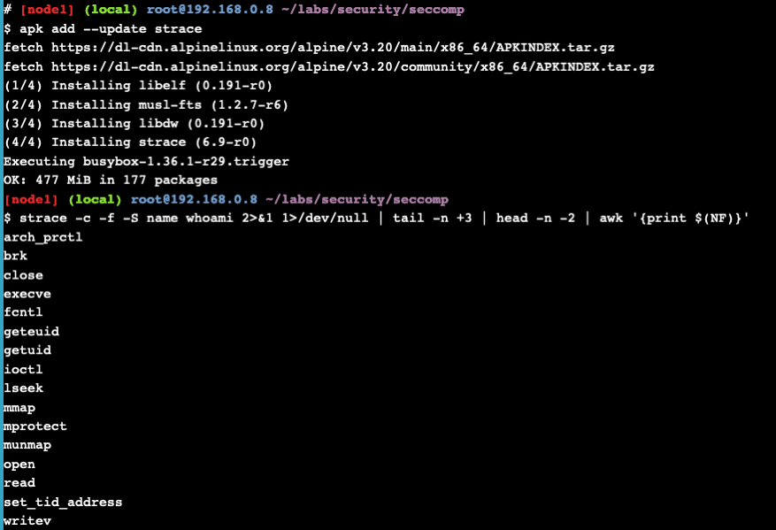

#### Step 4 - Selectively remove syscalls
```bash
docker run --rm -it --security-opt seccomp=./seccomp-profiles/default.json alpine sh
chmod 777 / -v
```
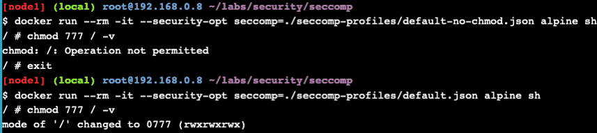

#### Step 5 - Write a seccomp profile
```bash
strace -c -f -S name ls 2>&1 1>/dev/null | tail -n +3 | head -n -2 | awk '{print $(NF)}'
```

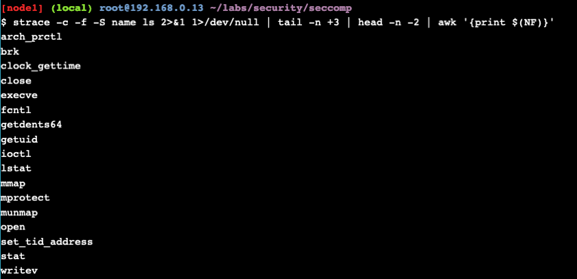

#### Step 6 - A few Gotchas
```
skip
```

### Lab: Capabilities

---

#### 1. Start a new container and prove that the container’s root account can change the ownership of files.

```bash
docker run --rm -it alpine chown nobody /
```

#### 2. Start another new container and drop all capabilities for the containers root account other than the CAP_CHOWN capability.
```bash
 docker run --rm -it --cap-drop ALL --cap-add CHOWN alpine chown nobody /
```

#### 3. Start another new container and drop only the CHOWN capability form its root account.
```bash
 docker run --rm -it --cap-drop CHOWN alpine chown nobody /
```

#### 4. Create another new container and try adding the CHOWN capability to the non-root user called nobody. As part of the same command try and change the ownership of a file or folder.
```bash
docker run --rm -it --cap-add chown -u nobody alpine chown nobody /
```

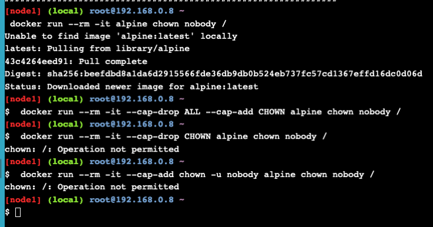

## Networking

### Section #1 - Networking Basics

#### Step 1: The Docker Network Command

```bash
docker network
```
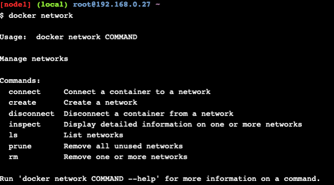


#### Step 2: List networks

```bash
docker network ls
```

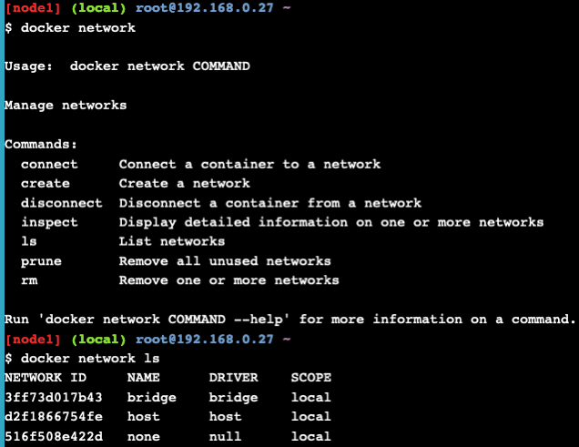

#### Step 3: Inspect a network

```bash
docker network inspect bridge
```

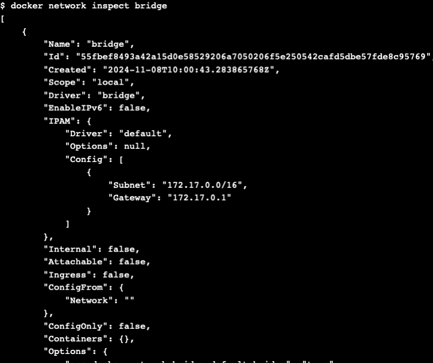

#### Step 4: List network driver plugins

```bash
docker info
```
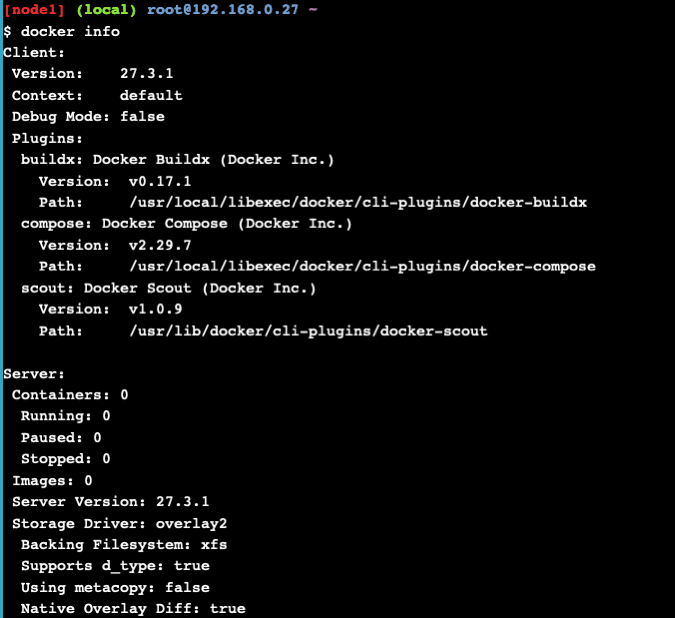

### Section #2 - Bridge Networking

#### Step 1: The Basics

```bash
docker network ls
```

```bash
apk update
apk add bridge
```

```bash
brctl show
```

```bash
ip a
```

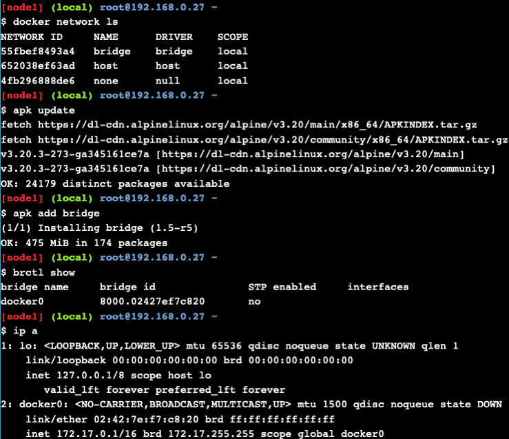

#### Step 2: Connect a container

```bash
docker run -dt ubuntu sleep infinity
```

```bash
docker ps
```

```bash
brctl show
```

```bash
docker network inspect bridge
```

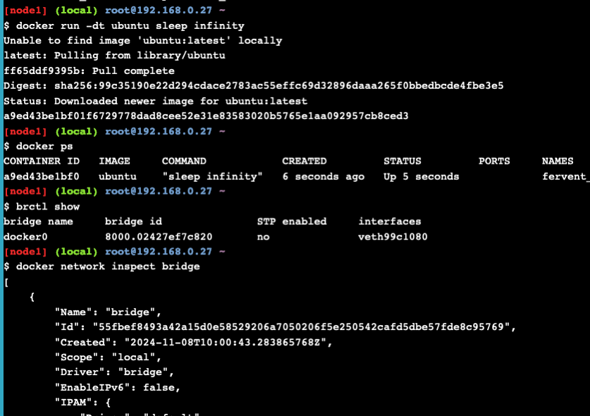

#### Step 3: Test network connectivity

```bash
apt-get update && apt-get install -y iputils-ping
```

```bash
  ping -c5 www.github.com
```

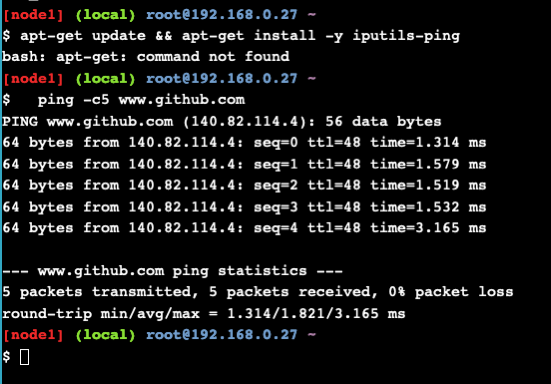


#### Step 4: Configure NAT for external connectivity

```bash
docker run --name web1 -d -p 8080:80 nginx
```

```bash
curl 127.0.0.1:8080
```
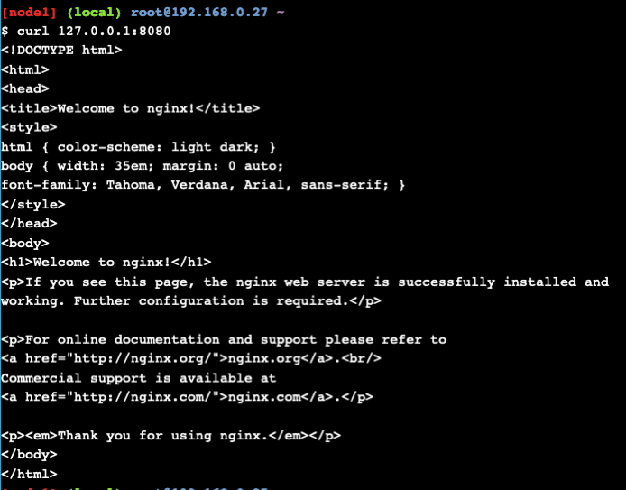


### Section #3 - Overlay Networking

#### Step 1: The Basics

```bash
docker swarm init --advertise-addr $(hostname -i)
```

```bash
docker node ls
```

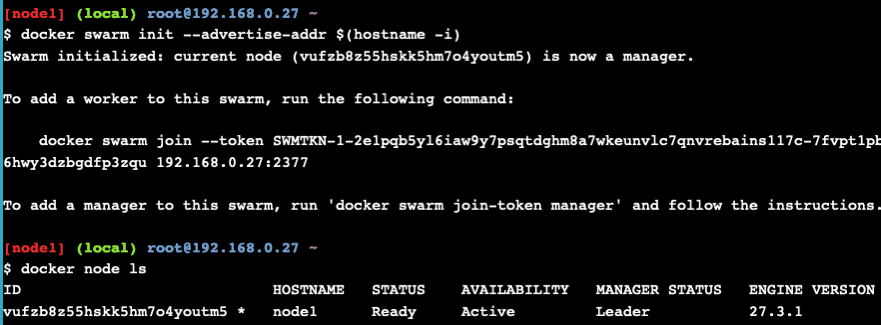

#### Step 2: Create an overlay network

```bash
docker network create -d overlay overnet
```

```bash
docker network ls
```

```bash
docker network inspect overnet
```

#### Step 3: Create a service

```bash
docker service create --name myservice \
--network overnet \
--replicas 2 \
ubuntu sleep infinity
```

```bash
docker service ps myservice
```
#### Step 4: Test the network
```bash
docker network inspect overnet
```

```bash
apt-get update && apt-get install -y iputils-ping
```

#### Step 5: Test service discovery

```bash
cat /etc/resolv.conf
```

```bash
docker service inspect myservice
```

### Cleaning Up

```bash
docker service rm myservice
```

```bash
docker ps
```

node 1
```bash
docker swarm leave --force
```

node 2
```bash
docker swarm leave --force
```

## Docker Orchestration Hands-on Lab

```bash
docker run -dt ubuntu sleep infinity
```
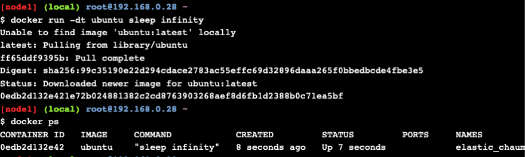

node1
```bash
docker swarm init --advertise-addr $(hostname -i)
```

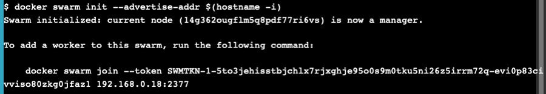

node2 & node 3
```bash
docker swarm join --token SWMTKN-1-13fg0z4jpxrgman26f3zud4iyu2yxyxgbfczdsqngmbqn1l2z0-88jkegm1t7ztrdoernnoi04r6 192.168.0.8:2377
```
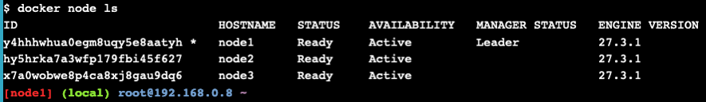
```bash
docker service create --name sleep-app ubuntu sleep infinity
docker service ls
```
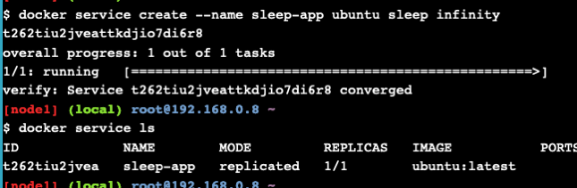

```bash
docker service update --replicas 7 sleep-app
docker service ps sleep-app
```
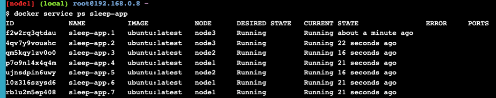

```bash
docker service update --replicas 4 sleep-app
docker service ps sleep-app
```
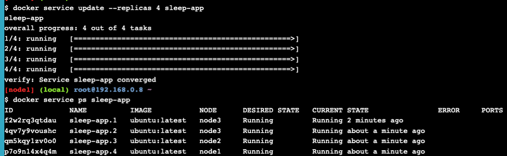

#### Cleaning Up

```bash
docker service rm sleep-app
```

```bash
docker ps
docker kill 9373628fbf6b
#docker kill yourcontainerid
```

node 1 & node 2 & node 3
```bash
docker swarm leave --force
```

## Docker for IT Pros and System Administrators Stage 3

# [Нет доступа к ресурсам курса]
