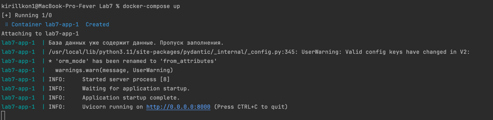
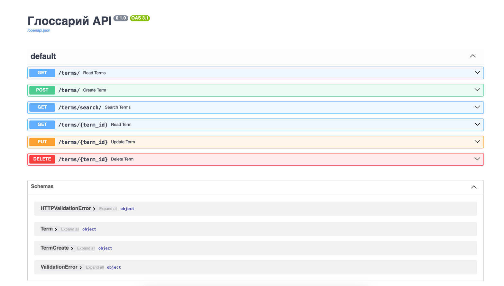
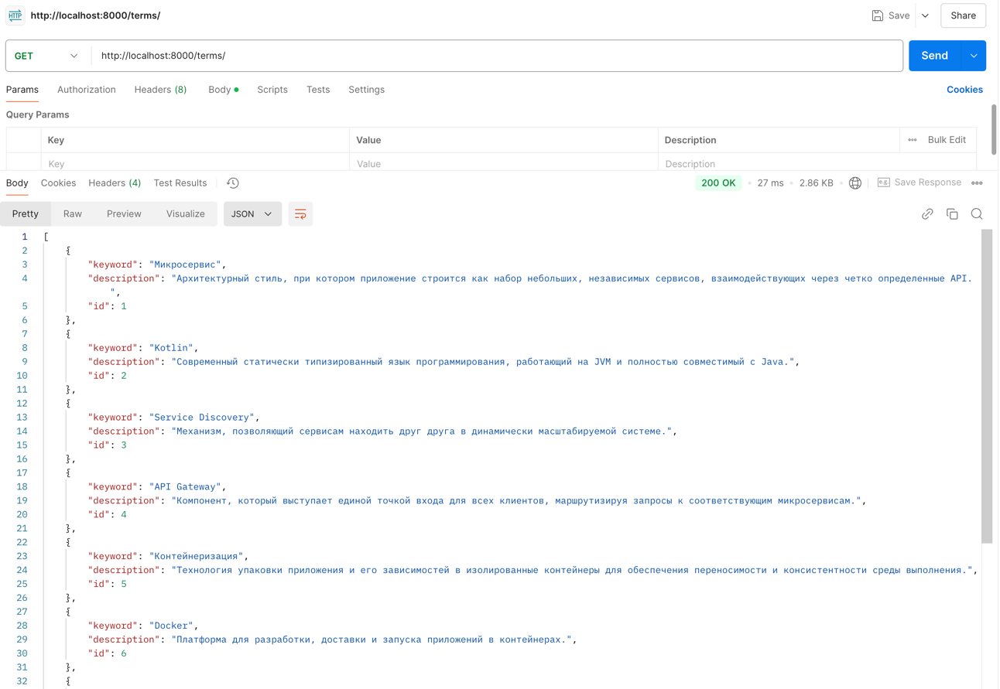
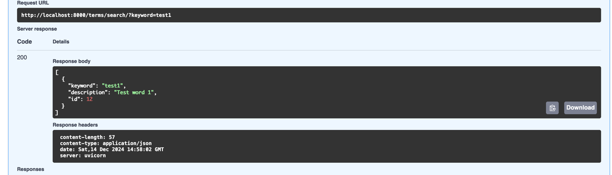
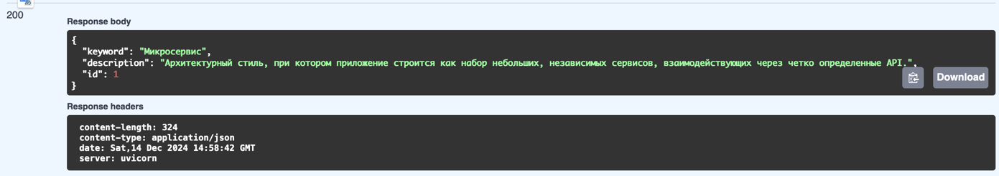
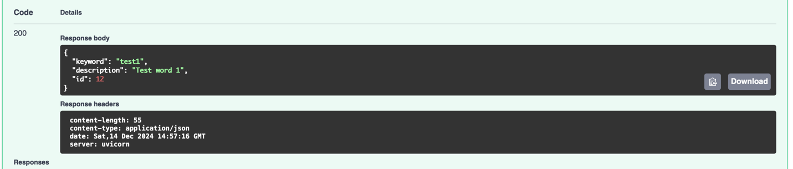
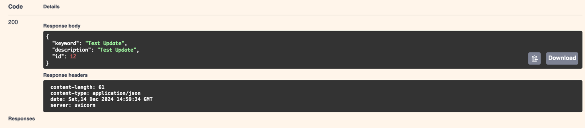
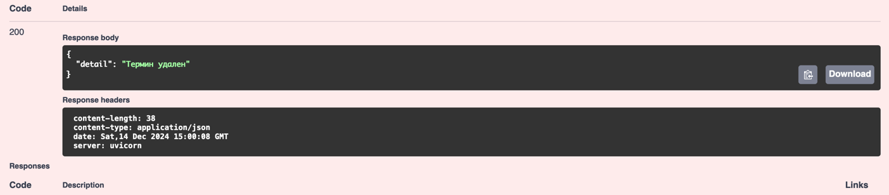

# Лабораторная работа №7. REST. FastAPI. Swagger

## Запуск проекта 

```bash
docker-compose up
```



## Демонстрация

### Swagger




### Получение списка всех терминов.

```
curl -X 'GET' \
  'http://localhost:8000/terms/?skip=0&limit=100' \
  -H 'accept: application/json'
```



### Получение информации о конкретном термине по ключевому слову.


``` 
curl -X 'GET' \
  'http://localhost:8000/terms/search/?keyword=test1' \
  -H 'accept: application/json'
```



### Получение термина по id

```
curl -X 'GET' \
  'http://localhost:8000/terms/1' \
  -H 'accept: application/json'
```



### Добавление нового термина с описанием.
```
curl -X 'POST' \
  'http://localhost:8000/terms/' \
  -H 'accept: application/json' \
  -H 'Content-Type: application/json' \
  -d '{
  "keyword": "test1",
  "description": "Test word 1"
}'
```


### Обновление существующего термина.

```
curl -X 'PUT' \
  'http://localhost:8000/terms/12' \
  -H 'accept: application/json' \
  -H 'Content-Type: application/json' \
  -d '{
  "keyword": "Test Update",
  "description": "Test Update"
}'
```



### Удаление термина из глоссария.

``` 
curl -X 'DELETE' \
  'http://localhost:8000/terms/12' \
  -H 'accept: application/json'
```

